# IoT Edge. Develop and debug IoT Edge custom modules. Implement and debug IoT inter-module communication.

## Preface
The purpose of this hands-on walkthrough is to demonstrate how a developer can start building IoT Edge modules locally in VS Code with C# and .NET Core. No Azure resources needed during development and debugging. This walkthrough was built after I collected my first experiences with the [official Microsoft documentation](https://docs.microsoft.com/en-us/azure/iot-edge/how-to-vs-code-develop-module?view=iotedge-2018-06) on this topic. I decided to slightly optimize the developer experience, highlight and deepen some topics mentioned the link above, and also extend the content with an additional custom IoT module and an example of inter-module communication.
## Introduction
As the [IoT Edge documentation](https://docs.microsoft.com/en-us/azure/iot-edge/about-iot-edge?view=iotedge-2018-06) states, "Azure IoT Edge moves cloud analytics and custom business logic to devices so that your organization can focus on business insights instead of data management. 
...
IoT Edge modules are units of execution, implemented as Docker compatible containers, that run your business logic at the edge. Multiple modules can be configured to communicate with each other, creating a pipeline of data processing. You can develop custom modules or package certain Azure services into modules that provide insights offline and at the edge"
## Prerequisites
* [Visual Studio Code](https://code.visualstudio.com/) 
* [Azure IoT Tools](https://marketplace.visualstudio.com/items?itemName=vsciot-vscode.azure-iot-tools)
* [Docker extension](https://marketplace.visualstudio.com/items?itemName=PeterJausovec.vscode-docker)
* [Visual Studio extension for C#](https://marketplace.visualstudio.com/items?itemName=ms-dotnettools.csharp)

## Create your IoT Edge solution with Azure IoT Tools
Invoke the Command Palette (F1) and select the following:
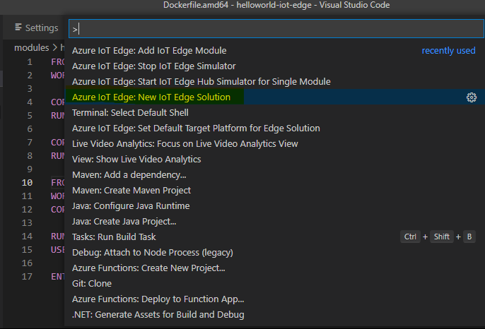

Select root directory of your IoT Edge solution:
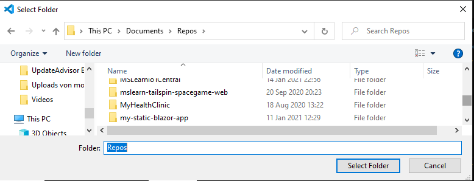

Give it a name:

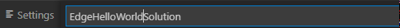

Add a custom IoT module:
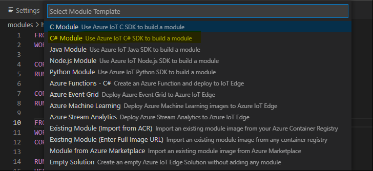

Give your first module a name:
 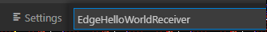

It is called Receiver because we will also build a Sender module demonstrating a simple way to communicate between modules.

We will use a local docker repository for the development, please leave default or provide your repository name:
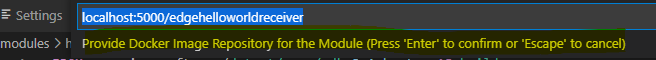

Your VS Code will restart in the directory you selected for the IoT Edge solution:
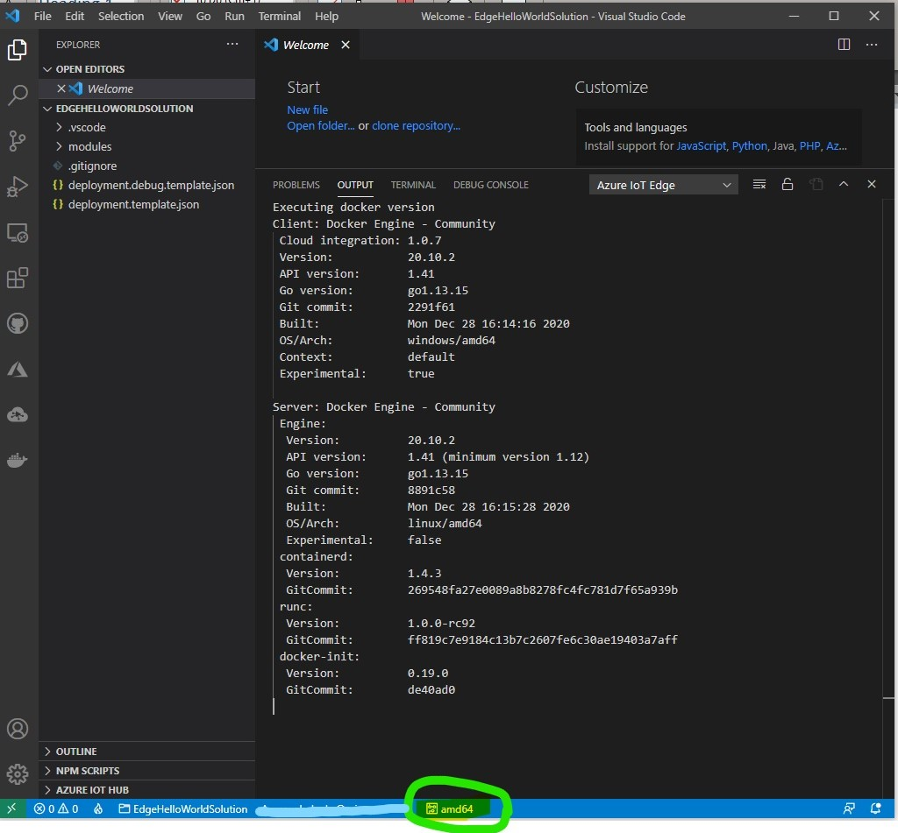

Please be aware of the default platform architecture above.

Review the created files and folders and the launch configurations: 
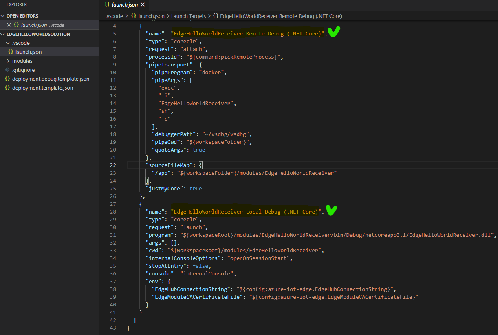

Open the folder containing your generated module:
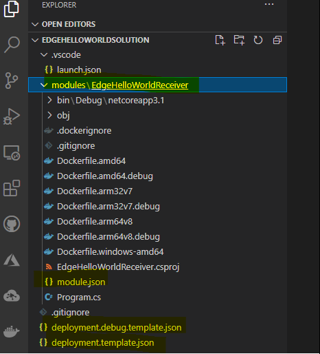

Have a look at the generated IoT Edge deployment template manifest with two modules (one custom and another standard - SimulatedTemperatureSensor) and routes between them:

The SimulatedTemperatureSensor is delivered only for the testing purposes to demonstrate how messages can be sent (in this case SimulatedTemperatureSensor ) and received by the custom module. A new custom module EdgeHelloWorldSender will be introduced later here and will substitute SimulatedTemperatureSensor.

Look at the Docker files:
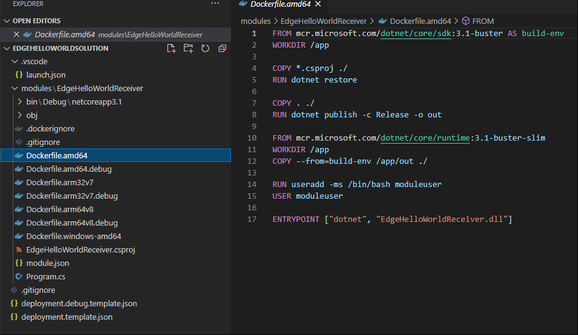

And finally start your first custom module in the IoT Edge Simulator:
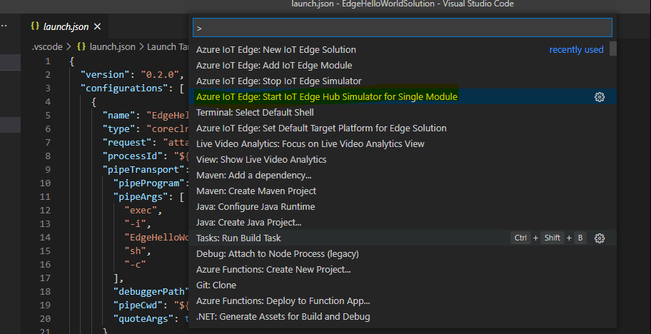

Provide input - edit for just "input 1":
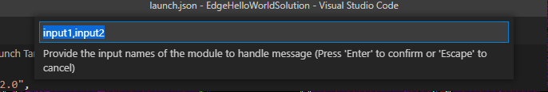

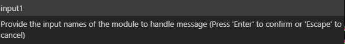

Have a look at the result:
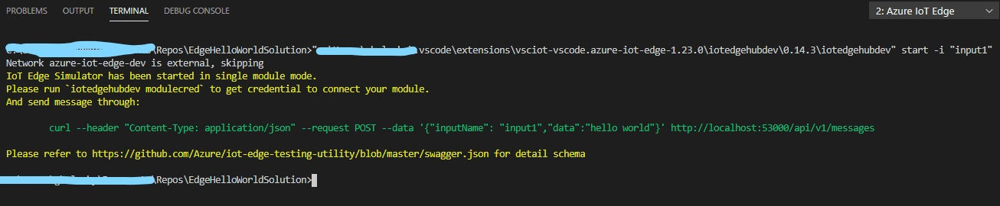

Inspect running containers:
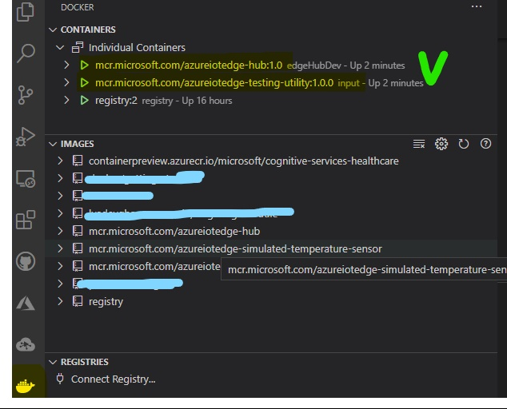

The edgeHubDev container is the core of the local IoT Edge simulator. It can run on your development machine without the IoT Edge security daemon and provides environment settings for your native module app or module containers. The input container exposes REST APIs to help bridge messages to the target input channel on your module.

Test the your connectivity to local IoT Edge simulator through the bridging REST API by starting the curl command above or sending a post request in Postman:
 curl --header "Content-Type: application/json" --request POST --data '{"inputName": "input1","data":"hello world"}' http://localhost:53000/api/v1/messages

 Please be aware that your first custom module was not built yet and will not be able to reply to the messages sent to "input1" 

This is the response of the POST request above:
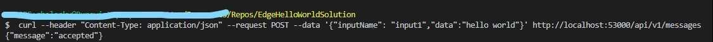

Now build and test your custom module.Change the directory to our module (EdgeHelloWorlsReceiver in my case) in the VS Code terminal and build it:
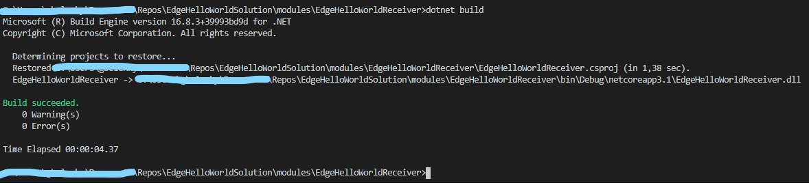

Start local debugging:
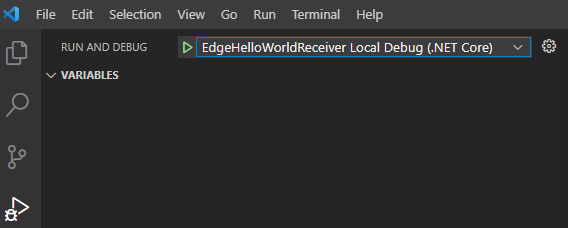

Now run the curl command again and see the output in the debug console:
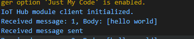

Please make sure that the IoT Edge Simulator started for a single module is still running, otherwise your custom modeule cannot respond. To validate that have a look at the running containers:
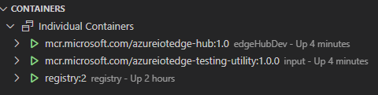

Set a breakpoint in your custom module's Program.cs and run curl script again. Watch some variables at the breakpoint after you sent a new HTTP Post request to the IoT Edge Simulator:
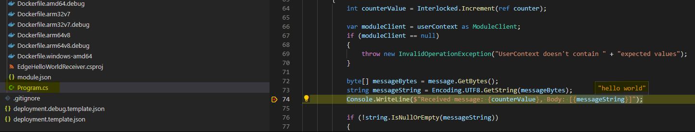

Now it is time to see how the complete solution is working - SimulatedTemperatureSensor sending messages through input1 to the EdgeHelloWorlsReceiver:
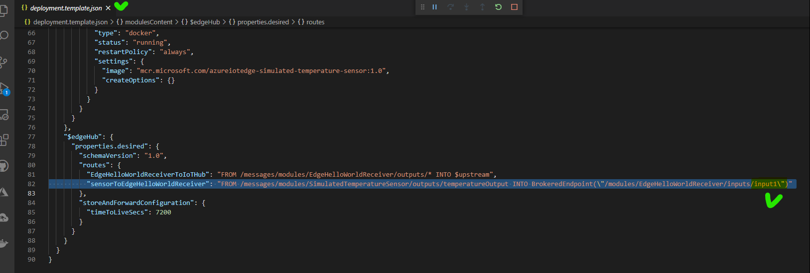

Stop debugging and stop the Simulator for single module from the Command Palette>
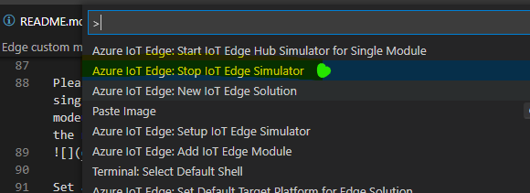

Start the IoT Edge Simulator. Now it will be started for all modules in your IoT Edge Solution. The Simulator will use the deployment.template.json to download and run locally docker images referred in the template - for instance SimulatedTemperatureSensor. You custom module container will be built locally and you will be able to debug it in the attached debugger mode:
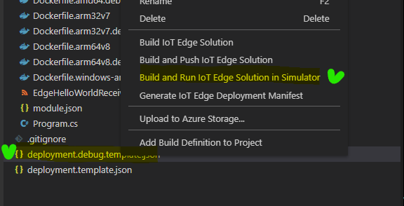

this will take some time...

After that you will discover the following containers running on your machine:

In the terminal you will see that the SimulatedTemperatureSensor send messages to the custom module EdgeHelloWorldReceiver:
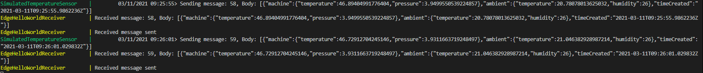

Since you started the IoT Edge Solution from the deployment.debug.template.json , you will be able to debug your custom module in the attached debug mode:

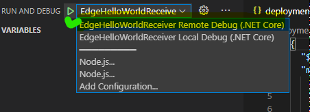

Select your module:
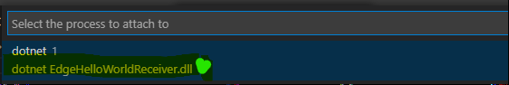

Add a breakpoint and watch a variable:
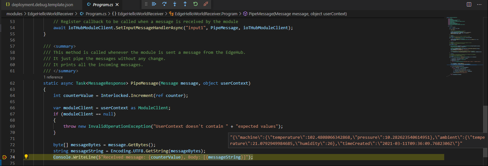

Stop debugging. Stop the IoT Edge Simulator
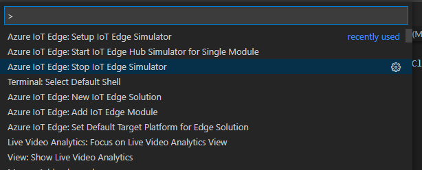

Create a new EdgeHelloWorldSender custom module
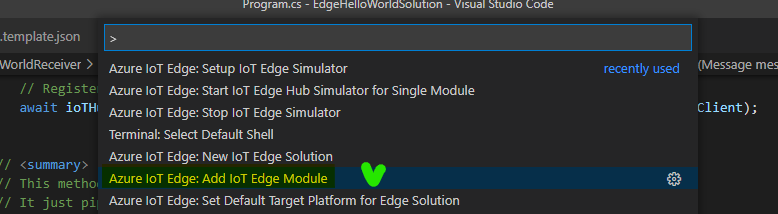

Select the deployment template file:

Be aware that your debug template will also be updated.

Select C#
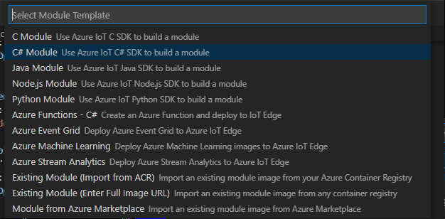

Provide a name:
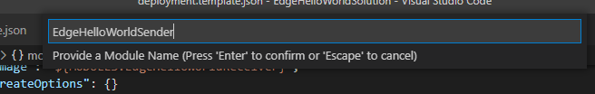

Take the same local container registry:
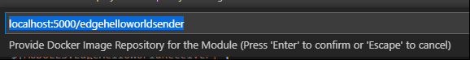

Review the modules and the deployment templates:
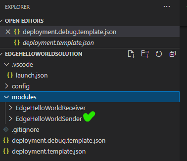

Inspect the routes in the deployment template files:
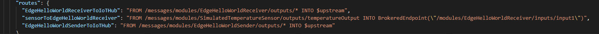

Start IoT Edge simulator after deploying the new module:
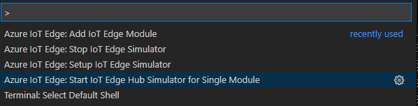

Build the EdgeHelloWorldSender module (change the folder and run dotnet build):
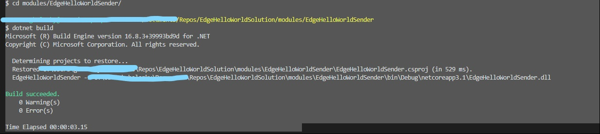

Start debugging the EdgeHelloWorldSender module
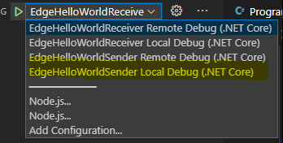

It will behave the same way as the EdgeHelloWorldReceiver
Send the  curl --header "Content-Type: application/json" --request POST --data '{"inputName": "input1","data":"hello world"}' http://localhost:53000/api/v1/messages request

Inspect the result:
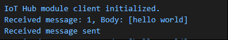

Stop debugging
Now we will modify the solution wiring up both EdgeHelloWorldSender and EdgeHelloWorldReceiver.

Modify the EdgeHelloWorldSender module Program.cs Init method:
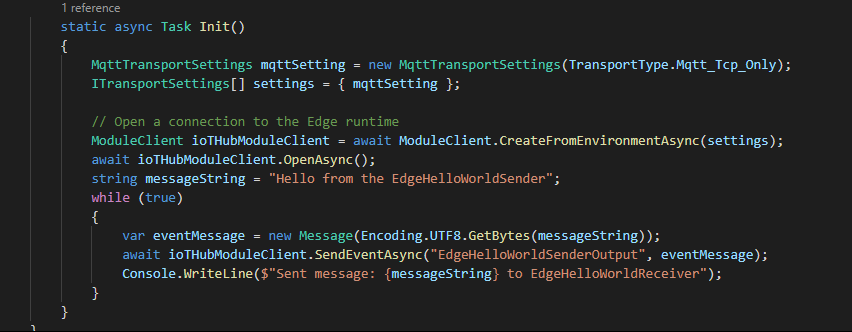

Change the routes in the deployment template files removing references to the SimulatedTemperatureSensor in the routes and modules section:
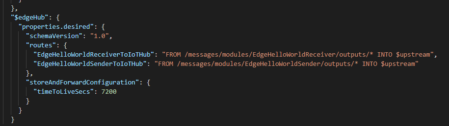

Now run the IoT Edge Simulator from the debug deployment template:
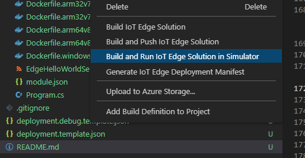

Now you will see the following output:
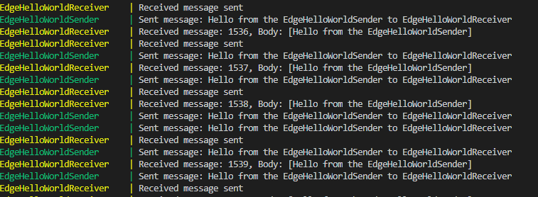

You can now run your modules in the attached debugger mode as it was described above, set breakpoints and inspect variables.

Stop the IoT Edge Simulator from the VS Code Command Palette:
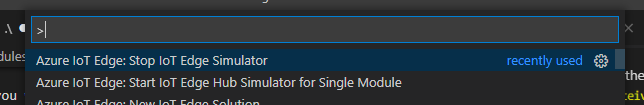

Your simulator will be stopped:
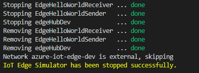

